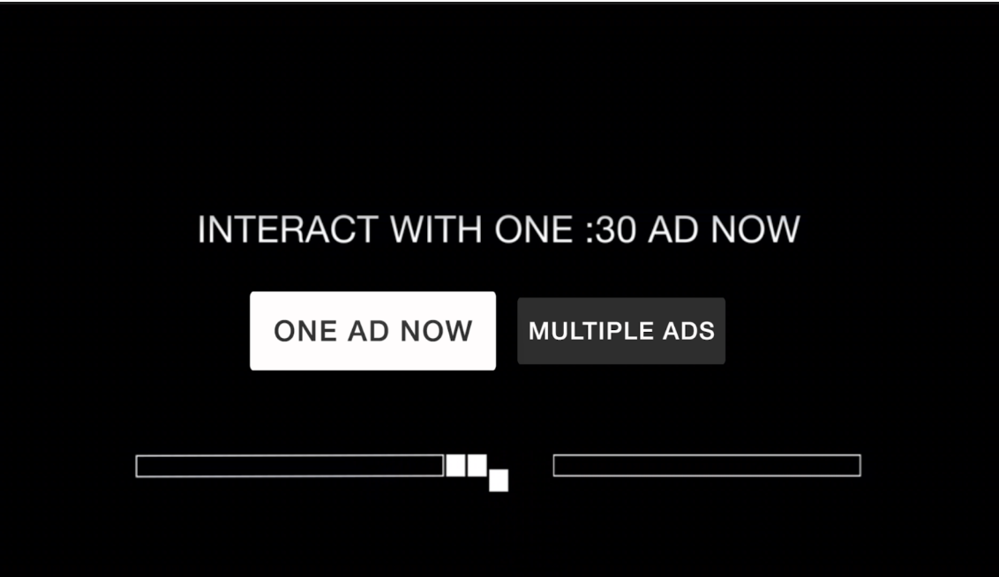

# TruexAdRenderer Roku Documentation

Version 1.0.1

## Contents

* [Overview](#overview)
* [Product Flows](#product-flows)
* [How to use TruexAdRenderer](#how-to-use-truexadrenderer)
    * [When to show True\[X\]](#when-to-show-truex)
    * [Handling Events from TruexAdRenderer](#handling-events-from-truexadrenderer)
    * [Handling Ad Elimination](#handling-ad-elimination)
* [TruexAdRenderer Roku API](#truexadrenderer-roku-api)
    * [Reference to Truex Component Library](#reference-to-truex-component-library)
    * [TruexAdRenderer Input Events](#truexadrenderer-input-events)
        * [init](#init)
        * [start](#start)
    * [TruexAdRenderer Output Events](#truexadrenderer-output-events)
        * [adStarted](#adstarted)
        * [adCompleted](#adcompleted)
        * [adError](#aderror)
        * [noAdsAvailable](#noadsavailable)
        * [adFreePod](#adfreepod)
        * [optIn (optional)](#optin-optional)
        * [optOut (optional)](#optout-optional) 
        * [skipCardShown (optional)](#skipcardshown-optional) 
        * [userCancel (optional)](#usercancel-optional) 
        * [userCancelStream (optional)](#usercancelstream-optional) 

## Overview

In order to support interactive ads on Roku, TrueX has created a
renderer component library that can renderer TrueX ads natively, which
interfaces with a hosting channel, as well as its existing ad server and
content delivery mechanism (e.g. SSAI).

With this library, the host player app can defer to the TruexAdRenderer
when it is required to display a TrueX ad.

For simplicity, publisher implemented code will be referred to as
“channel code” while TrueX implemented code will be referred to as
“renderer code”.

TrueX will provide a Roku `TruexLibrary` component library that can be
loaded into the app. This library will offer a component,
`TruexAdRenderer`, that will need to be instantiated, initialized and
given certain commands (described below in [TruexAdRenderer Input Events](#truexadrenderer-input-events)) by the channel
code.

At this point, the renderer code will take on the responsibility of
requesting ads from TrueX server, creating the native UI for the TrueX
choice card and interactive ad unit, as well as communicating events to
the channel code when action is required.

The channel code will still need to parse out the SSAI ad response,
detect when a TrueX ad is supposed to display, pause the stream,
instantiate `TruexAdRenderer` and handle any events emitted by the
renderer code.

It will also need to handle skipping ads in the current ad pod, if it is
notified to do so.

## Product Flows

There are two distinct product flows supported by `TruexAdRenderer`:
Sponsored Stream (full-stream ad-replacement) and Sponsored Ad Break
(mid-roll ad-replacement).

In a Sponsored Ad Break flow, once the user hits a mid-roll break with a
TrueX tag flighted, they will be shown a "choice-card" offering them the
choice between watching a normal set of video ads or a fully interactive
TrueX ad:

***Fig. A** example true\[X\] mid-roll choice card*

If the user opts for a normal ad break, or if the user does not make a
selection before the 30 second countdown timer expires, the TrueX UI
will close and playback of normal video ads can continue as usual.

If the user opts to interact with TrueX, an interactive ad unit will be
shown to the user:

***Fig. B** example true\[X\] interactive ad unit*

The requirement for the user to "complete" this ad is for them to spend
at least 30 seconds on the unit and for at least one interaction
(navigating anywhere through the ad).

***Fig. C** example true\[X\] attention timer*

Once the user fulfills both requirements, a "Watch Your Show" button
will appear in the bottom right, which the user can select to exit the
TrueX ad. Having completed a TrueX ad, the user will be returned
directly to content, skipping the remaining ads in the current ad pod.

The Sponsored Stream flow is quite similar. In this scenario, a user
will be shown a choice-card in the preroll:

***Fig. D** example true\[X\] preroll choice card (full-stream
replacement)*

Similarly, if the user opts-in and completes the TrueX ad, they will be
skipped over the remainder of the pre-roll ad break. However, every
subsequent mid-roll break in the current stream will also be skipped
over. In this case instead of the regular pod of video ads, the user
will be shown a "hero card" (also known as a "skip card"):

***Fig. E** example true\[X\] mid-roll skip card*

This messaging will be displayed to the user for several seconds, after
which they will be returned directly to content.

## How to use TruexAdRenderer 

### When to show True\[X\]

Upon receiving an ad schedule from your SSAI service, you should be able
to detect whether or not TrueX is returned in any of the pods. TrueX ads
should have `apiFramework` set to `VPAID` or `truex`.

SSAI vendors differ in the way they convey information back about ad
schedules to clients. Certain vendors such as Verizon / Uplynk expose
API’s which return details about the ad schedule in a JSON object. For
other vendors, for instance Google DAI, the TrueX payload will be
encapsulated as part of a companion payload on the returned VAST ad. The
Roku RAF library also exposes various wrappers which encapsulate vendor
specific logic into a simple interface. Please work with your TrueX
point of contact if you have difficulty identifying the right approach
to detecting the TrueX placeholder, which will be the trigger point for
the ad experience.

Once the player reaches a TrueX placeholder, it should pause,
instantiate the `TruexAdRenderer` and immediately trigger `init`
followed by `start` events.

Alternatively, you can instantiate an `init` of the
`TruexAdRenderer` in preparation for an upcoming placeholder. This
will give the `TruexAdRenderer` more time to complete its initial ad
request, and will help streamline TrueX load time and minimize wait time
for your users. Once the player reaches a placeholder, it can then call
`start` to notify the renderer so that it can display the unit to the
user.

### Handling Events from TruexAdRenderer

Once `start` has been called on the renderer, it will start to emit
events (a full list of events is available in [TruexAdRenderer Output Events](#truexadrenderer-output-events)).

One of the first events you will receive is `adStarted`. This notifies
the app that the renderer has received an ad for the user and has
started to show the unit to the user. The app does not need to do
anything in response, however it can use this event to facilitate a
timeout. If an `adStarted` event has not fired within a certain amount
of time, the app can trigger `stop` on the renderer and proceed to
normal video ads.

If there were no ads available to the user or if there was an error
making the ad request, `noAdsAvailable` or `adError` will fire
respectively. At this point, the app should resume playback without
skipping any ads, so the user receives a normal video ad payload.

Another important event to listen for is `adFreePod`. This signifies
that the user has earned a credit with TrueX and, once the renderer
signals it is complete (via the `adCompleted` event), all linear video
ads remaining in the current pod should be skipped. It’s important to
note that the player should not immediately resume playback once
receiving this event -- rather it should note that it was fired and
continue to wait for an `adCompleted` event.

Other possible events emitted on exit by the TruexAdRenderer are
`exitSelectWatch` or `exitAutoWatch`. These occur respectively when
the user opts out of TrueX, or when she lets the choice card countdown
expire. If so, playback still should resume, but without fast-forwarding
so the user receives the remaining payload of video ads.

### Handling Ad Elimination

Skipping video ads is completely the responsibility of the app code. The
SSAI API should provide enough information for the app to determine
where the current pod end-point is, and the channel, when appropriate,
should fast-forward directly to this point when resuming playback.

## TruexAdRenderer Roku API

This is an outline of `TruexAdRenderer` input and output events. Input
events are assigned on the `action` field from the interface of the
`TruexAdRenderer`, while output events are emitted against the
`event` field on the same component.

### Reference to Truex Component Library

The TrueX interactive ad component and its rendering logic are
distributed as part of a component library. It is required for the
hosting channel to add reference to the component library in order for
it to be used, for instance via the following reference added to your
channel’s main scene:

    <ComponentLibrary id="TruexAdLibrary" uri="http://static.truex.com.s3.amazonaws.com/roku/TruexAdRenderer-Roku-v0.9.0.pkg"/>

### TruexAdRenderer Input Events

#### init

    m.tar = m.top.createChild("TruexAdLibrary.TruexAdRenderer")
    m.tar.observeFieldScoped("event", "handleTarEvent")
    m.tar.observeFieldScoped("request", "handleTarPlaybackRequest")

    m.tar.action = {
        type : "init",
        creativeURL : "<creative URL returned by SSAI>",
        adParameters : "<Ad parameters associative array as returned by
        SSAI>",
        slotType : "<the type of the current ad pod>"
    }

This event will be triggered by the channel code in order to
instantiate the `TruexAdRenderer`. The renderer will parse out the
`creativeURL`, `adParameters` and `slotType` passed to it and
make a request to the TrueX ad server to see what ads are available.

You may instantiate `TruexAdRenderer` early (a few seconds before
the next pod even starts) in order to give it extra time to make the
ad request. The renderer will output a `fetchAdComplete` event at
completion of this ad request. The event can be used to coordinate the
call to `start` described next.

The parameters for this method call are:

* `creativeURL`: TrueX asset url returned by SSAI. In the example of Uplynk, this would correspond to `response.ads.breaks[0].ads[0].creative`
* `adParameters`: AdParameters as returned by SSAI. In the example of Uplynk, this would correspond to `response.ads.breaks[0].ads[0].adParameters`
* `slotType`: the type of the current ad pod, `PREROLL` or `MIDROLL`

#### start

    m.tar.action = {
        type : "start"
    }

This method will be called by the channel code when the TrueX unit is
ready to be displayed to the user. This can be called anytime after
the unit is initialized.

The channel should have as much extraneous UI hidden as possible,
including player controls, status bars and soft buttons/keyboards,
where possible.

Once `start` is called, the renderer will wait for the ad request
triggered in `init` to finish.

If the request returns an ad, the renderer will immediately
instantiate a `TruexChoiceCard` component and add it to the
`TruexAdRenderer` parent component. Once this is complete, it will
fire the `adStarted` event. The user will be shown the TrueX choice
card once all relevant assets have loaded. `adFreePod`,
`exitSelectWatch` or `exitAutoWatch` may fire after this point,
depending on the user’s choices. An `adCompleted` event will always
follow all other events at the end of a non-error flow.

If the request returns no ads, the renderer will fire the
`noAdsAvailable` event.

If the request signals that the user is in an ad-free state, then the
renderer will immediately instantiate a `TruexSkipCard` component
and add it to the `TruexAdRenderer` parent component. Once this is
complete, it will fire the `adStarted` and `skipCardShown` events.
After 3 seconds of a “skip card” being shown to the user, the
`adFreePod` event will fire, followed immediately by the
`adCompleted` event.

If the request fails, the renderer will fire the `adError` event.

There are no parameters for this event.

### TruexAdRenderer Output Events 

#### adStarted

    function handleTarEvent(evt as Object) as Void
    adEvent = evt.getData()

    ' adEvent : {
    '     type : "adStarted",
    '     campaignName : &lt;string representing the campaign name&gt;
    ' }

This event will fire in response to the `start` input event when the
TrueX UI is ready and has been added to the component hierarchy.

The parameters for this event are:

* `campaignName`: The name of the ad campaign available to the user (e.g. "*US Air Force - Special OPS (TA M) - Q1 2017*")

#### adCompleted

    function handleTarEvent(evt as Object) as Void
    adEvent = evt.getData()

    ' adEvent : {
    '     type : "adCompleted",
    '     timeSpent : <integer representing the amount of time spent>
    ' }

This event will fire when the TrueX unit is complete -- at this point,
the app should resume playback and remove the `TruexAdRenderer`
component from the Scene Graph.

Here are some examples where `adCompleted` will fire:
* User opts for normal video ads (not TrueX)
* 15 second choice card countdown runs out
* User completes TrueX ad unit (or taps I’m done)
* After a “skip card” has been shown to a user for 3 seconds

The parameters for this event are:

* `timeSpent`: The amount of time (in seconds) the user spent on the TrueX interactive ad unit -- set to 0 if the user did not earn an ad free credit or if the user was shown a "skip card".

#### adError

    function handleTarEvent(evt as Object) as Void
    adEvent = evt.getData()

    ' adEvent : {
    '     type : "error",
    '     errorMessage : &lt;string representing the error message&gt;
    ' }

This event will fire when the TrueX unit has encountered an error it
cannot recover from. The app code should handle this the same way as
an `adCompleted` event - resume playback and remove the
`TruexAdRenderer` component from the Scene Graph.

#### noAdsAvailable

    function handleTarEvent(evt as Object) as Void
    adEvent = evt.getData()

    ' adEvent : {
    '     type : "noAdsAvailable"
    ' }

This event will fire when the TrueX unit has determined it has no ads
available to show the current user. The app code should handle this
the same way as an `adCompleted` event - resume playback and remove
the `TruexAdRenderer` component from the Scene Graph.

#### adFreePod

    function handleTarEvent(evt as Object) as Void
    adEvent = evt.getData()

    ' adEvent : {
    '     type : "adFreePod"
    ' }

This event will fire when the all remaining ads in the current ad pod
need to be skipped. The app code should notate that this event has
fired, but should not take any further action until it receives an
`adCompleted` or `adError` event.

*All following events are used mostly for tracking purposes -- no action is generally required:*

#### optIn *(optional)*

    function handleTarEvent(evt as Object) as Void
    adEvent = evt.getData()

    ' adEvent : {
    '     type : "optIn"
    ' }

This event will fire if the user selects to interact with the TrueX
interactive ad.

Note that this event may be fired multiple times if a user opts in to
the TrueX interactive ad and subsequently backs out.

#### optOut *(optional)*

    function handleTarEvent(evt as Object) as Void
    adEvent = evt.getData()

    ' adEvent : {
    '     type : "optOut"
    '     userInitiated : <true or false>
    ' }

This event will fire if the user opts for a normal video ad
experience. `userInitiated` will be set to true if this was actively
selected by the user, false if the user simply allowed the choice card
countdown to expire.

#### skipCardShown *(optional)*

    function handleTarEvent(evt as Object) as Void
    adEvent = evt.getData()

    ' adEvent : {
    '     type : "skipCardShown"
    ' }

This event will fire anytime a "skip card" is shown to a user as a
result of completing a TrueX Sponsored Stream interactive in an
earlier preroll.

#### userCancel *(optional)*

    function handleTarEvent(evt as Object) as Void
    adEvent = evt.getData()

    ' adEvent : {
    '     type : "userCancel"
    ' }

This event will fire when a user backs out of the TrueX interactive ad
unit after having opted in. This would be achieved by tapping the
"Yes" link to the “Are you sure you want to go back and choose a
different ad experience” prompt inside the TrueX interactive ad. The
user will be subsequently taken back to the Choice Card (with the
countdown timer reset to full).

Note that after a `userCancel`, the viewer can opt-in and engage
with an interactive ad again, so more `optIn`, `optOut`,
etc events may then be fired.

#### userCancelStream *(optional)*

    function handleTarEvent(evt as Object) as Void
    adEvent = evt.getData()

    ' adEvent : {
    '     type : "userCancelStream"
    ' }

This events conveys that a user has decided to cancel the stream
entirely. The channel, at this point, should treat this the same way
it would handle any other "exit" action from within the stream -- in
most cases this will result in the user being returned to an
episode/series detail page.
